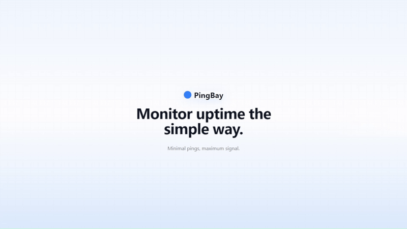
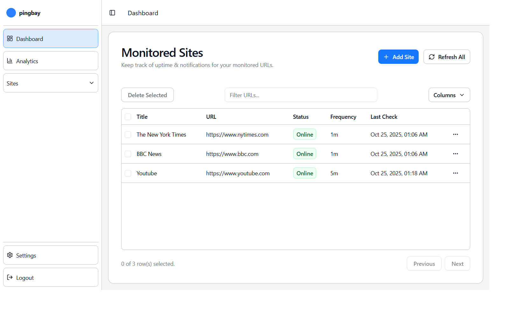
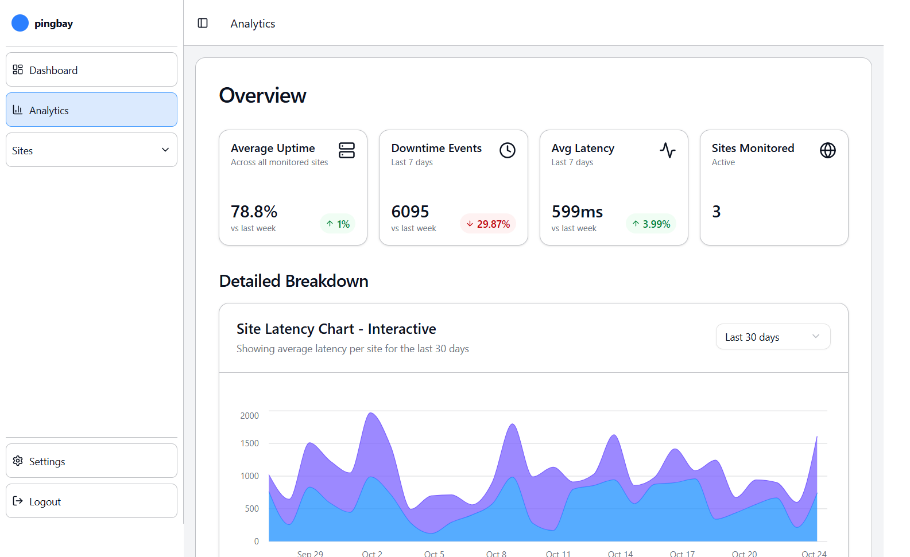
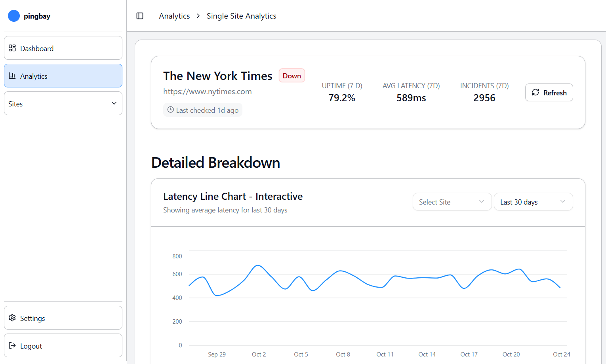
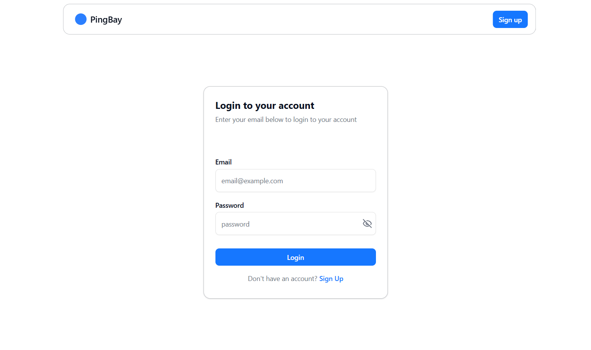
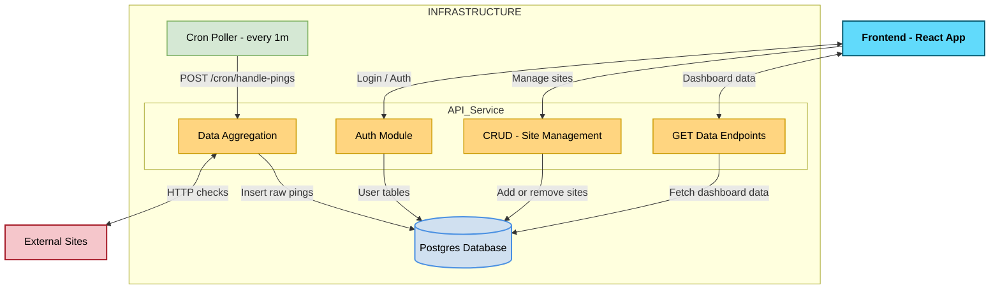

## 📑 Table of Contents
- [About](#about) — what PingBay does and why it exists
- [Key Features](#key-features) — main functionalities
- [Tech Stack](#tech-stack) — tools and technologies used
- [Quick Start](#quick-start-recommended---docker) — how to run the demo locally
- [Architecture](#architecture) — system structure and flow
- [Environment Variables](#note-on-environment-variables) — configuration info
- [Data Collection & Cron Jobs](#data-collection--cron-jobs) — monitoring mechanics
- [Future Roadmap / Improvements](#future-roadmap--improvements) — planned improvements

## 📌 About

Never miss a site outage again. PingBay transforms raw site metrics into actionable insights by continuously monitoring uptime, latency, and response errors for your websites. It provides developers, teams, and site owners with real-time dashboards that highlight trends, anomalies, and potential issues before they escalate. This full-stack project showcases automated background jobs, interactive data visualization, an automatic data aggregation pipeline, a sleek and modern UI, and a Docker-powered environment that can be launched locally in a single command, making it both demo-friendly and production-ready.

## ✨ Key Features

### Sleek Dashboard
Easily monitor all your tracked websites in one view. The dashboard shows each site’s uptime status, check frequency, and last ping time with real-time updates.  
&nbsp;

&nbsp;

### Overall Analytics
Get a high-level overview of all monitored sites — including aggregated uptime, downtime events, and average latency trends. Interactive charts visualize performance changes over time.  
&nbsp;

&nbsp;

### Single Site Analytics
Dive deep into the performance of individual sites. Each page displays historical uptime, latency, and incident counts with smooth visual charts for clear trend insights.  
&nbsp;

&nbsp;

### Secure Authentication
PingBay includes a full authentication system powered by **HTTP-only cookies** and **access tokens**, ensuring all protected routes are securely managed without exposing sensitive credentials to the browser.  
&nbsp;

&nbsp;


## 🛠️ Tech Stack

**Frontend:**      
**Backend:**     
**Database:**    
**Scheduling:**    
**Package Manager:**    
**Containerization:**  

## ⚡ Quick Start (Recommended — Docker)

This demo is designed for simplicity: with Docker installed, you can run the full PingBay website (frontend, backend, cron jobs, and PostgreSQL) locally with one command. The frontend will be available at http://localhost:5173.

Requirements:
- Docker & Docker Compose installed
- pnpm installed (for the convenience scripts below)

Clone the repository:

```bash
git clone https://github.com/yourusername/pingbay.git
cd pingbay
```

Run the full application:

```bash
pnpm start
```

This command spins up the frontend, backend, cron job, and PostgreSQL instances automatically using Docker.

**If a full experience is desired, please go to the settings and hit the populate data button to add simulated data for the last month.**

---

Once finished testing out PingBay, run the following command to wipe everything (database and containers):

```bash
pnpm delete
```

## 🏗️ Architecture

PingBay is built with a **modular, service-based architecture** designed for clarity, scalability, and maintainability. The system runs as a **four-service Docker composition**, each handling a distinct layer of responsibility:

1. **Frontend Service** — A React + Vite + TypeScript client served on port `5173`, responsible for user interaction, real-time visualization, and dashboard management.
2. **Backend API Service** — A Node.js + Express server managing authentication, data routing, and data aggregation.
3. **Database Service** — A PostgreSQL instance storing site metadata, ping results, and aggregated statistics for analytics.
4. **Cron Service** — A lightweight scheduler that periodically triggers background jobs on the API.

These services communicate seamlessly within Docker’s shared network, ensuring full isolation from the host machine and easy reproducibility across environments.

### System Overview
Below is a high-level overview of how PingBay’s components interact.



**Flow Summary:**
- The **Frontend** sends authenticated requests to the API.
- The **Backend** processes site checks, retrieves analytics data, and exposes REST endpoints.
- The **Database** stores both raw ping results and aggregated metrics for visualization.

### Data Flow
PingBay automates the process of uptime monitoring through a continuous data loop:

1. **Scheduler** triggers pings at defined intervals.
2. **Ping Results** are recorded in PostgreSQL, with latency, uptime, and failure details.
3. **Aggregator** jobs compute summaries for analytics charts.
4. **Frontend UI** consumes this data to render real-time graphs and tables.

### Docker Composition
Each service runs as an isolated container managed by Docker Compose (simplified file):

```yaml
services:
  web:
    build: ./web
    ports:
      - "5173:5173"
  api:
    build: ./api
    ports:
      - "5000:5000"
    depends_on:
      - db
  db:
    image: postgres:15
    ports:
      - "5432:5432"
```

## ⚙️ Note on Environment Variables

For this demo, two files have been provided: .env.api.example and .env.web.example, which have been filled out with the appropriate variable for the demo. The contents of these files are cloned into newly made .env files when the docker demo is run. 

## 📚 Future Roadmap / Improvements

* Email / SMS notifications for downtime.
* Weekly reports sent via email.
* Real-time updates using WebSockets.

## 👤 Author
**Ethan Snyder**  
[LinkedIn](https://www.linkedin.com/in/ethan-snyder30) • [Portfolio](https://ethansnyder.dev) • [Email](mailto:edsnyder1@geneva.edu)

## 🧾 License

This project is licensed under the MIT License.
See the [LICENSE](LICENSE) file for details.